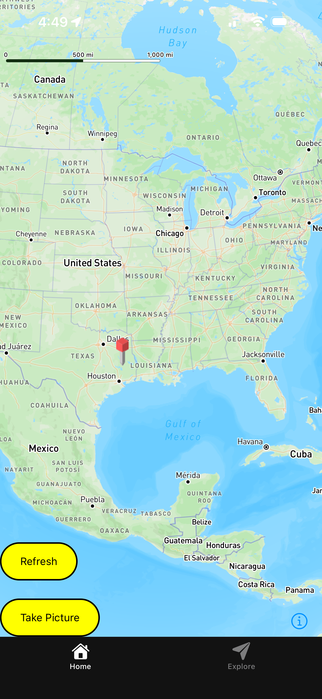
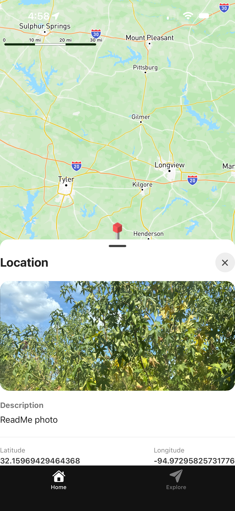

# 📍 GeoPhoto

GeoPhoto is a full-stack location-based photo application that allows users to capture and associate photos with geographic locations.

The project is being developed as a cross-platform application with a React Native mobile application, a React web application, an ASP.NET Core REST API, and a PostgreSQL database.

> **Project Status:** In Active Development  
> **Project Type:** Personal Full-Stack Project

---

## 📱 Screenshots

Screenshots will be added as the web and mobile interfaces are further developed.

### Mobile Application



### Location Details



### Web Application

Incoming.

---

## ✨ Features

### Currently Implemented

- Interactive map interface
- Geographic location pins
- Capture and upload location-based photos
- Mobile application built with React Native and Expo
- REST API built with ASP.NET Core
- PostgreSQL database
- Entity Framework Core database access
- Entity Framework Core migrations
- Location data stored through the backend API
- Mobile-to-backend API communication
- Location creation and retrieval

### In Development

- React web frontend
- Location exploration feed
- Location lists
- Popular location lists
- Filtering and discovery options
- User profiles
- Additional customization options
- Improved location and pin interactions

---

## 🛠️ Technologies

### Mobile

- React Native
- Expo
- Expo Router
- TypeScript
- JavaScript
- Expo Location

### Web

- React
- Vite
- JavaScript
- HTML
- CSS

### Backend

- C#
- ASP.NET Core
- REST API
- Entity Framework Core

### Database

- PostgreSQL
- Npgsql
- Entity Framework Core Migrations

### Development Tools

- Git
- GitHub
- Visual Studio
- Visual Studio Code
- pgAdmin
- npm

---

## 🏗️ Architecture

GeoPhoto uses a full-stack architecture with separate mobile and web clients communicating with a centralized ASP.NET Core backend.

```text
                         GeoPhoto
                            │
              ┌─────────────┴─────────────┐
              │                           │
              ▼                           ▼
       React Native                    React
          Mobile                        Web
              │                           │
              └─────────────┬─────────────┘
                            │
                       HTTP Requests
                            │
                            ▼
                    ASP.NET Core API
                            │
                            ▼
                    Entity Framework Core
                            │
                            ▼
                       PostgreSQL
```

### Frontend

GeoPhoto has separate mobile and web clients.

The mobile application is built using React Native, Expo, and Expo Router. The web application is being developed using React and Vite.

Both clients communicate with the backend through HTTP requests to the REST API.

This allows the mobile and web applications to share the same backend and database rather than implementing separate data systems for each platform.

### Backend

The backend is an ASP.NET Core Web API written in C#.

The API acts as the middle layer between the frontend applications and the PostgreSQL database.

It receives HTTP requests from the frontend, processes the requested operation, and uses Entity Framework Core to interact with the database.

```text
React Native / React
        │
        │ HTTP Request
        ▼
ASP.NET Core Controller
        │
        ▼
Entity Framework Core
        │
        ▼
PostgreSQL
```

### Entity Framework Core

Entity Framework Core (EF Core) is the ORM used to connect the ASP.NET Core application to PostgreSQL.

EF Core allows database entities to be represented as C# objects and provides an abstraction for querying and modifying database data.

EF Core migrations are also used to create and update the PostgreSQL database schema as the application develops.

### PostgreSQL

PostgreSQL provides persistent storage for GeoPhoto's application data.

The database stores information associated with locations and other application entities.

---

## 🌐 REST API

The backend exposes REST API endpoints that allow the frontend applications to interact with GeoPhoto's data.

### Current Endpoints

| Method | Endpoint | Purpose |
|--------|----------|---------|
| GET | `/locations` | Retrieve stored locations |
| POST | `/locations` | Create a new location |

The API is designed so that both the mobile and web applications can communicate with the same backend services.

As development continues, additional endpoints will be added for functionality such as updating, deleting, filtering, and retrieving individual locations.

---

## 📍 Location System

Location functionality is one of the core components of GeoPhoto.

The mobile application can obtain geographic coordinates from the device and associate those coordinates with uploaded content.

Locations are represented using geographic coordinates such as latitude and longitude.

The general data flow is:

```text
User
 │
 ▼
Mobile Application
 │
 │ Capture Photo / Location
 ▼
React Native
 │
 │ HTTP Request
 ▼
ASP.NET Core API
 │
 ▼
Entity Framework Core
 │
 ▼
PostgreSQL
 │
 ▼
Location Available to Frontend
 │
 ▼
Display Location on Map
```

Once a location has been stored, the application can retrieve the location data through the API and display it as a pin on the map.

---

## 🗺️ Map Functionality

The map serves as the primary interface for discovering location-based content.

Current functionality includes:

- Displaying geographic locations as map pins
- Selecting locations
- Creating new locations
- Associating content with geographic coordinates
- Sending location data to the backend API
- Retrieving stored locations from the API

Planned functionality includes:

- Improved pin interactions
- Location exploration
- Location lists
- Popular locations
- Filtering and discovery tools
- Improved focus and camera behavior when creating locations

---

## 📸 Photo & Location Workflow

A primary goal of GeoPhoto is to connect photographs with geographic locations.

The intended workflow is:

```text
User
 │
 ▼
Capture Photo
 │
 ▼
Obtain Geographic Coordinates
 │
 ▼
Create Location Data
 │
 ▼
Send Data to REST API
 │
 ▼
ASP.NET Core
 │
 ▼
Entity Framework Core
 │
 ▼
PostgreSQL
 │
 ▼
Location Available to Frontend
 │
 ▼
Display Location on Map
```

This allows the geographic location to become part of the application's data rather than simply being a temporary value used by the mobile device.

---

## 👨‍💻 Development Focus

GeoPhoto is being developed as a full-stack project to gain practical experience across multiple layers of application development.

The project provides hands-on experience with:

- React Native mobile development
- React web development
- Expo and Expo Router
- C# development
- ASP.NET Core
- REST API development
- Entity Framework Core
- PostgreSQL
- Database migrations
- HTTP client/server communication
- Geographic coordinates
- Map-based interfaces
- Cross-platform application architecture
- Git and GitHub
- Full-stack application development

---

## 🚀 Getting Started

### Prerequisites

To run GeoPhoto locally, you will need:

- Node.js
- npm
- .NET SDK
- PostgreSQL
- Git
- Visual Studio or Visual Studio Code
- An Expo-compatible mobile device or emulator for the mobile application

### Backend

Navigate to the backend project:

```powershell
cd MapAppApi
```

Restore the .NET dependencies:

```powershell
dotnet restore
```

Apply the Entity Framework Core migrations:

```powershell
dotnet ef database update
```

Start the API:

```powershell
dotnet run
```

The API will then be available for the frontend applications to communicate with.

### Mobile Application

Navigate to the mobile project:

```powershell
cd <mobile-project-folder>
```

Install dependencies:

```powershell
npm install
```

Start the Expo development server:

```powershell
npx expo start
```

The mobile application can then be opened using an Expo-compatible physical device or emulator.

### Web Application

Navigate to the web frontend:

```powershell
cd <web-project-folder>
```

Install dependencies:

```powershell
npm install
```

Start the Vite development server:

```powershell
npm run dev
```

The web application can then be opened using the local development address provided by Vite.

> **Note:** Database connection strings, API addresses, and other environment-specific configuration should be configured locally rather than committed to the repository.

---

## 🔐 Security

GeoPhoto separates the frontend applications from the backend and database.

The frontend applications communicate with the ASP.NET Core API rather than connecting directly to PostgreSQL.

This architecture allows the backend to control how application data is created, retrieved, and modified.

Sensitive configuration such as database credentials, API keys, and other environment-specific secrets should not be committed to the repository.

---

## ⚠️ Project Status

GeoPhoto is currently under active development.

The mobile application and backend contain the primary implemented functionality, while the web frontend is still being developed.

Some planned functionality has not yet been implemented.

The application should therefore be considered a development and portfolio project rather than a production-ready application.

---

## 🔮 Future Improvements

Planned improvements include:

- Complete the React web frontend
- Improve the map user interface
- Add location exploration feeds
- Add location lists
- Add popular locations
- Add filtering functionality
- Add user profiles
- Add additional customization options
- Improve pin creation and interaction
- Add improved photo management
- Expand the REST API
- Add update and delete functionality for locations
- Improve error handling
- Add automated testing
- Improve authentication and authorization
- Improve application state management
- Deploy the application for public use

---

## 📚 Project Goals

The primary goal of GeoPhoto is to build a complete application spanning mobile development, web development, backend development, and database management.

Rather than building only a standalone frontend, the project is designed around a full-stack architecture:

```text
Frontend
   │
   ▼
REST API
   │
   ▼
Application Logic
   │
   ▼
Entity Framework Core
   │
   ▼
PostgreSQL
```

The architecture allows the same backend services to support both the mobile and web applications while providing hands-on experience with modern full-stack development.

---

## 📌 Project Highlights

- Cross-platform mobile application
- React web application
- C# backend
- ASP.NET Core REST API
- Entity Framework Core
- PostgreSQL relational database
- Geographic location functionality
- Photo and location management
- Shared backend between mobile and web clients
- Database migrations and schema management
- Map-based user interface
- Git-based development
- Full-stack application development